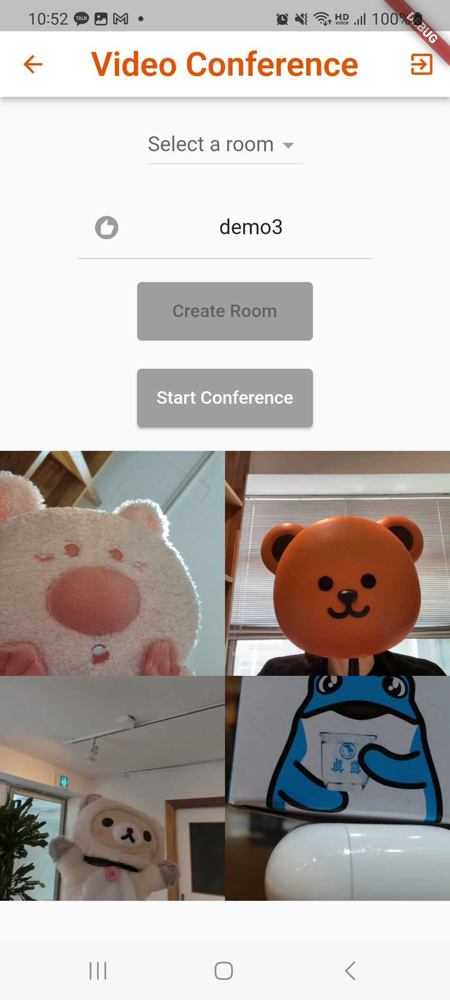
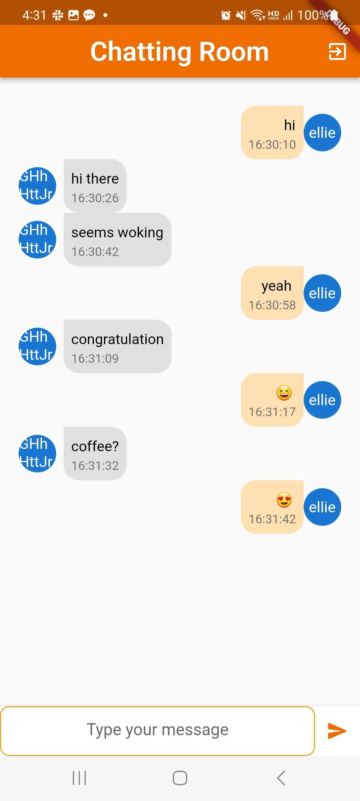
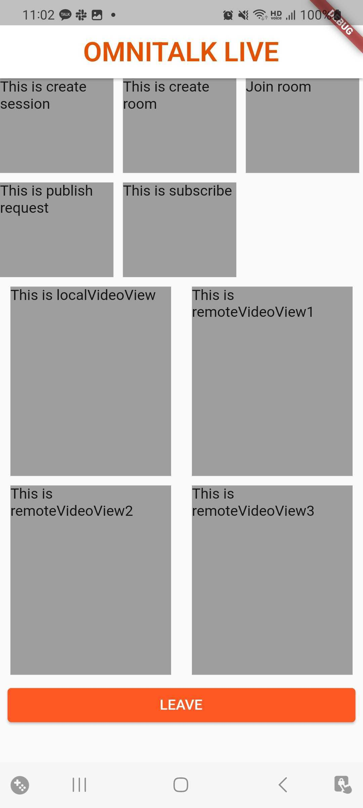

# flutter-library

<!--
This README describes the package. If you publish this package to pub.dev,
this README's contents appear on the landing page for your package.

For information about how to write a good package README, see the guide for
[writing package pages](https://dart.dev/guides/libraries/writing-package-pages).

For general information about developing packages, see the Dart guide for
[creating packages](https://dart.dev/guides/libraries/create-library-packages)
and the Flutter guide for
[developing packages and plugins](https://flutter.dev/developing-packages).
-->

Flutter SDK for real-time communication API based on WebRTC.

Easy way to integrate flutter_webrtc in your app.

<div style="display:flex;">

  <div style="flex:1; margin-right:5px;">





</div>
</div>

### Sample code

<details> 
<summary>
how to run sample code
 </summary>
 <div>

- api_test sample is a testbed for testing functionality. You can check how each api works with it.

- video_conference is a simple app for real time video conference.

1.  download the sample
2.  open it in VSC(recommended) and run `flutter pub get`
3.  replace the service id, service key argument with active ones in lib>screen>video_conference.dart

- You can get a 1-hour test key for free

<div style="display:flex;">
  <div style="flex:1; margin-right:5px;">
    
  </div>
  <div style="flex:1; margin-right:5px;">
    
  </div>
  <div style="flex:1;">
    
  </div>
</div>


- If you want to use the code in your app, make sure these below. The sample codes we provide already have set them and you don't need further job.

  - minimun sdk version

  android>app>build.gradle

  compileSdkVersion is 33, minSdkVersion 21

  - device permission
    - android>app>src>main>AndroidManifest.xml

  ```
  <uses-permission android:name="android.permission.CAMERA" />
  <uses-permission android:name="android.permission.INTERNET" />
  <uses-permission android:name="android.permission.READ_PHONE_STATE" />
  <uses-permission android:name="android.permission.RECORD_AUDIO" />
  <uses-permission android:name="android.permission.MODIFY_AUDIO_SETTINGS" />
  <uses-permission android:name="android.permission.ACCESS_NETWORK_STATE" />
  <uses-permission android:name="android.permission.BLUETOOTH" />
  <uses-permission android:name="android.permission.ACCESS_WIFI_STATE" />
  <uses-permission android:name="android.permission.READ_EXTERNAL_STORAGE" />
  <uses-permission android:name="android.permission.WAKE_LOCK" />
  ```

       - ios>Runner>info.plist

  ```
  <key>NSCameraUsageDescription</key>
  <string>$(PRODUCT_NAME) Camera Usage!</string>
  <key>NSMicrophoneUsageDescription</key>
  <string>$(PRODUCT_NAME) Microphone Usage!</string>
  ```

  * For updated chatting room
  Uncomment the code in main.dart to test chatting room demo.

 </div>
</details>

<br>

## Features

- create session
- create room
- join room
- publish
- subscribe
- get room list
- get participants list
- dataChannel
- setAudioMute
- setVideoMute

## Pre-Requisite

- flutter_webrtc ^0.9.24
- This sdk is developed under Flutter 3.7.6, Dart 2.19.3
- omnitalk service id, service key
- compatible library version 21+

## Getting started

### 0. Set your minimun sdk requirements

Go to android>app>build.gradle in your working directory.

    // compileSdkVersion flutter.compileSdkVersion
    compileSdkVersion 33

    // minSdkVersion flutter.minSdkVersion
    minSdkVersion 21

### 1. Visit [omnitalk.io](https://omnitalk.io/demo/video) to get omnitalk service id and service key

<details>
<summary>
You can also get a one-hour test key
</summary>


</details>
<br>

### 2. Import omnitalk_sdk in your app

Add following lines to `pubspec.yaml` under dependencies

    dependencies:
        omnitalk_sdk: 0.0.1
        flutter_webrtc ^0.9.24

or you can add it by running code below in terminal.

    flutter pub add omnitalk_sdk

### 3. Initialize Omnitalk instance with your service id and key

    final Omnitalk omnitalk;
    omnitalk = Omnitalk(service id, service key)

### 4. Get your RTCVideoRenderer

Omnitalk supports 32 users at the same time.

Declare renderers and pass them as an argument to publish() for local or to subscribe() for remote according to its use.

## Usage

To establish a real time video conference using Omnitalk's platform (with plans to introduce features such as audio calls, conferences, and more), the following methods may be useful.

**1) create session**

Argument 'user_id' is optional. If you don't put user_id, omnitalk will give you a random id.

    session = await omnitalk.createSession(user_id);

**2) create room & join the room**

Make a room and join the room. You can get a room list first before make a room. You can also pass a room subject, room secret if you want.

    roomObj = await omnitalk.createRoom(subject: roomSubject);
    roomId = roomObj?["room_id"];
    await omnitalk.joinRoom(room_id: roomId);

**3) publish**


By publishing you start broadcasting. Pass the RTCVideoRenderer localrenderer and add it to your UI widget. You can also set resolution in publishing. Default resolution is 'HD'. Full description is below.


    publishIdx = await omnitalk.publish(
      localRenderer: localVideo,
            callType: "videocall", record: false, 
            resolution: 'FHD');

    //in your widget
    Container(
                color: Colors.grey,
                height: 200,
                width: 160,
                child: displayOn ? RTCVideoView(localVideo) : null,
              ),

<details><summary>resolution descriptions</summary>
<div>
<table>

| resolution | width * height |
|----------|----------|
| QVGA | 320 * 240 |
| VGA | 640 * 480 |
| SD | 720 * 480 |
| HD | 1280 * 720 |
| FHD | 1920 * 1080 |
| 2k | 2560 * 1440 |
| 4k | 1840 * 2160 |

</table>
</div>
</details>

**4) subscribe**

To subscribe other broadcasting, pass the publish index. You can get publish_index by listening to 'BROADCASTING_EVENT' from server. Or you can get participants' list before you subscribe one.

     var partiResult = await omnitalk.partiList(roomId);

        for (var parti in partiResult) {
          int pubIdx = parti["publish_idx"];
          partiList.add(pubIdx);
        }

        for (int i = 0; i < partiList.length; i++) {
          int pubidx = partiList[i];

          await omnitalk.subscribe(
              publishIdx: pubidx, remoteRenderer: remoteVideos[i]);
        }

**5) dataChannel**

To make a chatting room, create a room with room_type = "dataroom". Omnitalk server streams messages, which you can simply get by listening to the event. You can see a chatting example, API reference and its usage in [omnitalk.io](https://omnitalk.io/docs/flutter/api-reference)
  ```
  await omnitalk.createRoom(room_type: "dataroom", secret: secret);
  ```
  ```
  omnitalk.onDataMessage = (event) async {
      switch (event["textroom"]) {
        case "join":
          onDataRoomJoin(event["username"]);
          getParticipants(event);
          break;
        case "message":
          setState(() {
            onMessageReceived(event);
          });
          break;
      }
  }
  ```

**6) setAudio/Video mute
Pass the boolean toggle value as an argument to mute / unmute the audio. To pause or play video use setVideoMute(). It only controls video images not sound. If you want to mute both image and sound, call both methods.
```
bool toggle = true;
_onSetAudioMute() async {
    await omnitalk.setAudioMute(toggle);
    toggle = !toggle;
   
  }
```
```
bool toggle = true;
  _onSetVideoMute() async {
  await omnitalk.setVideoMute(toggle);
    toggle = !toggle;
  }
```

## Feedback

If you have any issues or suggestions, visit our [github repo](https://github.com/omnistory-labs/flutter-library.git) and create an issue.

## Additional information

For more information, visit [omnitalk.io](https://omnitalk.io)
